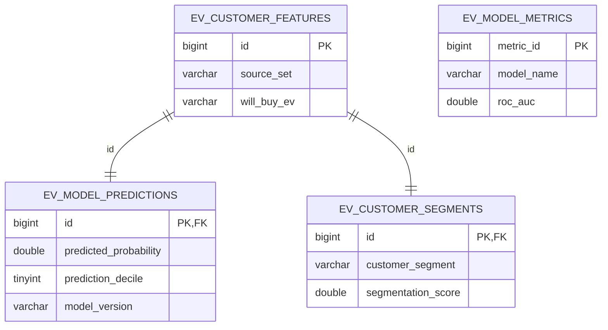

# EV Purchase Propensity & Customer Analytics

> **Publication boundary:** Competition code was first shared through the public [Kaggle Notebook](https://www.kaggle.com/code/kimzaiyi1/ev-purchase-propensity-reproducible-xgboost-cv). This GitHub mirror excludes competition data, row-level customer outputs, predictions, models, submissions, downloaded leaderboards and third-party reference notebooks. See [`PUBLICATION_NOTICE.md`](PUBLICATION_NOTICE.md).

This portfolio project turns 668,665 synthetic customer records into a validated EV-purchase propensity model and an actionable customer-segmentation workflow.

## Business Problem

Rank customers by EV purchase intent, explain the associated drivers and identify audiences for differentiated campaigns without presenting model associations as causal effects.

## Dataset

The [Kaggle Playground Series S6E9](https://www.kaggle.com/competitions/playground-series-s6e9/overview) provides 668,665 labelled rows, 286,571 test rows and 13 customer, infrastructure and motivation features. The target is `Will_Buy_EV`; raw competition data are excluded from Git.

## Analytics Workflow

Data audit -> business EDA -> baselines -> boosted-tree comparison -> Optuna tuning -> feature ablation -> multi-seed audit -> business SHAP/segments -> synthetic-artifact competition model -> OOF blend -> Kaggle submission.

## Model Validation

All primary comparisons use shuffled 5-fold StratifiedKFold. Preprocessing and target encoding are fitted within training folds. Five random seeds test split stability, and blend weights are selected only from out-of-fold predictions.

## Key Results

- Competition OOF ROC-AUC: **0.945713** using **Advanced + Base Blend**.
- Business-model OOF ROC-AUC: **0.941993** using base-feature five-seed XGBoost bagging.
- Validation: 5-fold StratifiedKFold plus five-seed stability audit.
- Leading drivers: Environmental_Concern_Level, Subsidy_Available, Annual_Income_USD, Range_Anxiety_Level, Age, Daily_Commute_km.
- Highest-priority segment: **High Potential** (20.0% of labelled customers; 67.0% mean OOF propensity).
- Kaggle result: **Public ROC-AUC 0.94589; rank 458/1,509 (top 30.4%)**.

## Customer Insights

See [`reports/business_report.md`](reports/business_report.md) for evidence on income, subsidies, charging, environmental concern, range anxiety, city type and commute distance.

## Business Recommendations

Prioritize scored High Potential customers, tailor infrastructure support for customers without home charging, and test subsidy/range messaging with randomized holdouts before scaling.

## Kaggle Result

Public ROC-AUC 0.94589; rank 458/1,509 (top 30.4%). This is a public-leaderboard snapshot; the private final ranking can change when the competition closes.

## SQL Analytics

The MySQL 8.0.42 pipeline has been executed locally against 955,236 customers. Python creates and loads four relational tables, runs 13 analytical exports, validates 13 database invariants and reconciles 18 Python/SQL metrics at zero difference. It uses real training OOF predictions and real test predictions; it does not retrain the Kaggle models.



Run the database workflow after copying `.env.example` to `.env` and filling in a local MySQL account:

```bash
python scripts/run_mysql_pipeline.py
```

Validated query outputs and execution evidence are under `outputs/sql/`. The schema and interview-oriented examples are in `sql/`; the Chinese learning guides are under `docs/sql/` and `docs/interview/`.

## Power BI

Dashboard-ready local CSVs are generated under `outputs/dashboard/`; the four-page design is documented in `reports/powerbi_dashboard_spec.md`.

## Repository Structure

`src/` contains reusable pipeline code, `notebooks/` the executed narrative, `reports/` recruiter-facing findings, and `outputs/` validated metrics and figures. Raw and row-level competition data are excluded from Git.

## Reproducibility

```bash
python -m pip install -r requirements.txt
python src/run_pipeline.py
python src/run_validation_audit.py
python src/external_data_check.py
python src/advanced_model.py
python src/refresh_outputs.py
python scripts/run_mysql_pipeline.py
python tests/verify_mysql_pipeline.py
```

Place official Kaggle files in `data/raw/`. The pipeline uses relative paths and a single random-state configuration.

## Limitations

The competition data are synthetic and the target is intent rather than observed purchase. Optuna uses a bounded stratified sample to control local compute. Digit/frequency features are competition-specific and excluded from business interpretation. External deployment requires probability calibration, drift monitoring and campaign experiments.
