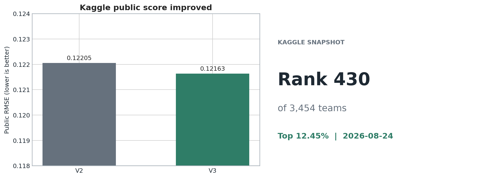
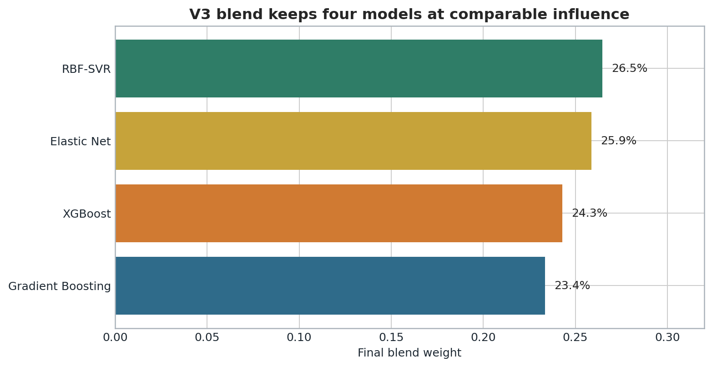
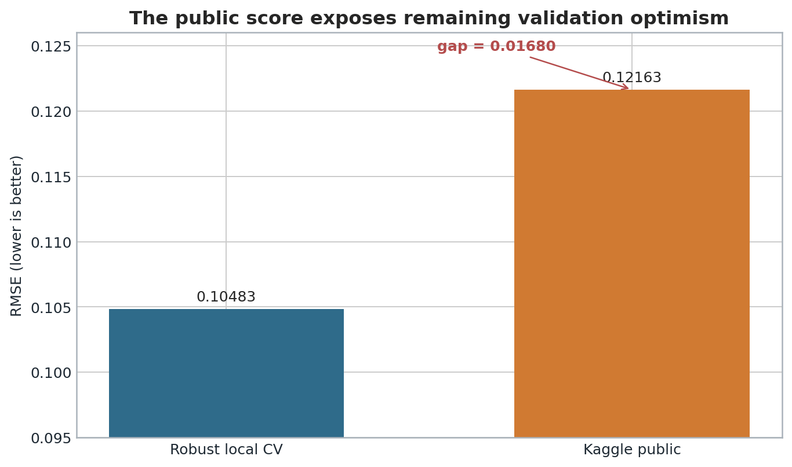

# Ames 房价预测：从基线到稳健融合

这是一个面向 Kaggle `House Prices - Advanced Regression Techniques` 的完整回归项目。项目从数据审计和缺失值语义判断开始，经过基线筛选、特征工程、交叉验证、残差诊断和稳健融合，最终生成可复现的提交文件。

## 最终结果

| 指标 | 结果 |
|---|---:|
| Kaggle Public Score | **0.12163** |
| 排名快照 | **430 / 3,454** |
| 排名前百分比 | **Top 12.45%** |
| 稳健本地交叉验证 RMSE | **0.10483** |
| V2 Public Score | 0.12205 |
| V3 相对 V2 改善 | 0.34% |

分数和排名来自 2026-08-24 的 Kaggle 快照。排名会随参赛人数和其他队伍提交发生变化。



## 我解决了什么问题

1. 区分“没有设施”和“数据未知”两类缺失值，避免把 `No Pool`、`No Garage` 等业务含义误当成普通空值。
2. 对右偏的房价使用对数建模，使训练目标与 Kaggle 的 RMSLE 评价逻辑一致。
3. 用 OOF 预测比较十类模型，而不是根据训练集拟合优度挑模型。
4. 发现原三模型残差相关性过高、价格两端存在回归均值问题，因此加入 RBF-SVR 并做轻度线性校准。
5. 用目标分层的元交叉验证约束融合权重，降低只在某一次随机切分上表现好的风险。
6. 对提交列名、行数、Id 顺序、重复值、缺失值和价格范围做自动检查。

## 最终模型

| 模型 | 作用 | 权重 |
|---|---|---:|
| Elastic Net | 稳定地捕捉大量稀疏线性关系 | 25.9% |
| Gradient Boosting | 拟合非线性关系并对异常值保持一定稳健性 | 23.4% |
| XGBoost | 学习变量之间更复杂的分裂和交互 | 24.3% |
| RBF-SVR | 补充平滑的非线性边界，降低与树模型的同质性 | 26.5% |

权重不是主观指定。它们来自非负、和为 1 的 OOF 误差最小化，并加入 L2 惩罚防止权重集中在单个模型上。



## 目录

```text
.
├── README.md
├── requirements.txt
├── data/                  # 数据下载与放置说明，不包含比赛原始数据
├── src/                   # 训练、预测、质量检查与制图代码
├── notebooks/             # 探索过程与早期版本
├── results/               # OOF、提交文件、分数、排名和诊断结果
├── figures/               # 报告图表
└── report/                # 中文报告、PDF 和模型通俗说明
```

## 快速复现

1. 从 Kaggle 下载 `train.csv`、`test.csv` 和 `sample_submission.csv`，放入 `data/`。
2. 建议使用 Python 3.11 或 3.12 创建虚拟环境并安装依赖。
3. 在项目根目录运行：

```bash
pip install -r requirements.txt
python src/train_and_predict.py --data-dir data --output-dir results/reproduced
python src/create_figures.py --data-dir data --results-dir results/reproduced --output-dir figures/reproduced
python src/qa_portfolio.py --project-dir .
```

最终可提交文件为 `results/reproduced/submission.csv`，仅包含两列：`Id` 和 `SalePrice`。

## 主要结论

本地验证从最佳单模约 `0.11000` 改善到 V3 的 `0.10483`，但 Kaggle Public Score 为 `0.12163`。差距说明当前验证仍然偏乐观，不能把本地 OOF 当成未知测试集成绩。对抗验证 AUC 约为 `0.516`，没有发现强烈的整体训练/测试分布漂移；更可能的原因是样本量小、反复试验带来的选择偏差，以及低价和高价样本仍有系统性残差。



## 项目边界

- 没有使用公开泄漏标签、外部成交价或手工修改测试答案。
- 没有宣称达到 `0.06`。在隐藏测试标签的前提下，该目标不能通过正常验证流程保证。
- 两个面积异常样本（Id 524、1299）仅从训练阶段移除，原始数据和处理记录均保留。
- 报告中的分数、排名和结论均可在 `results/` 中追溯。

完整分析见 [`report/项目复盘与实证分析.md`](report/项目复盘与实证分析.md)。

正式版报告：[`Word`](report/Ames房价预测_实证分析报告.docx) · [`PDF`](report/Ames房价预测_实证分析报告.pdf)
