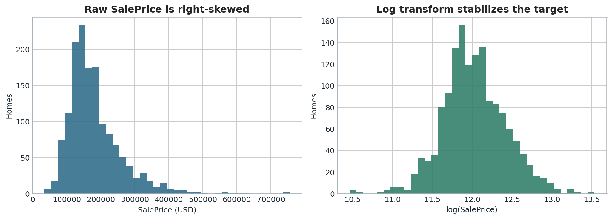
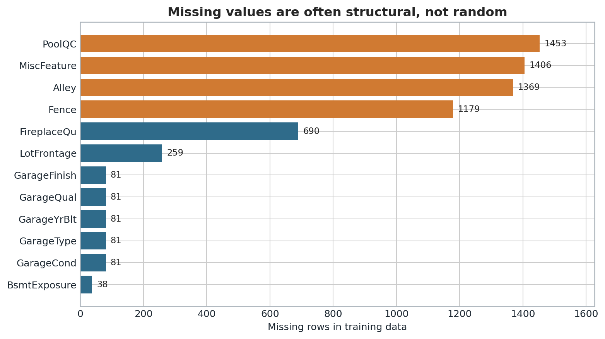
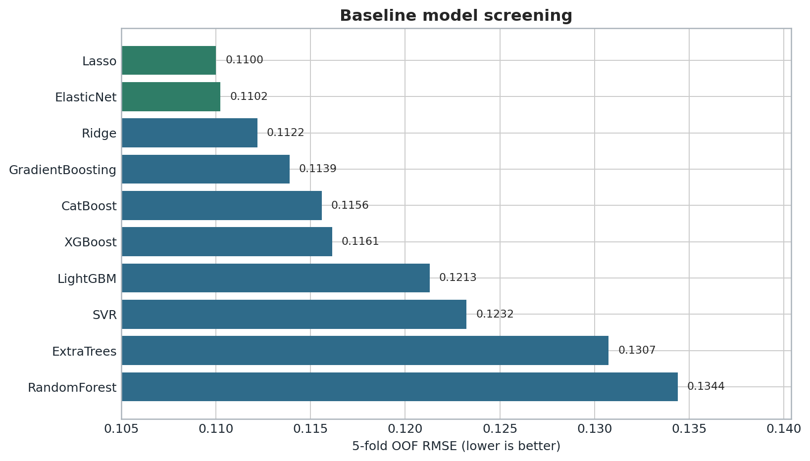
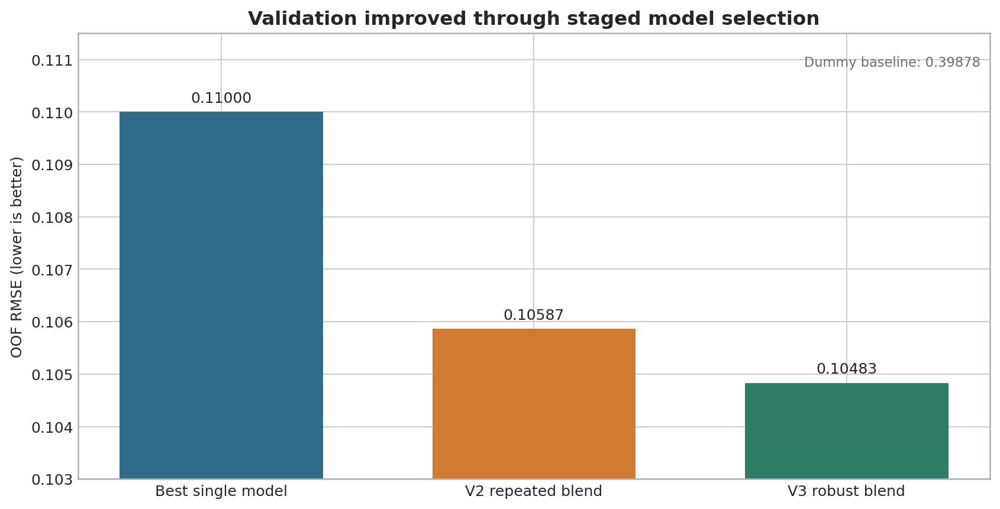
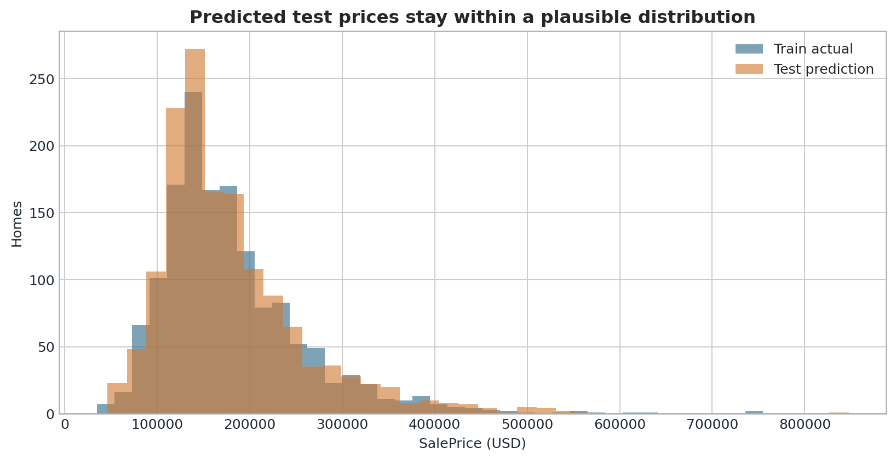
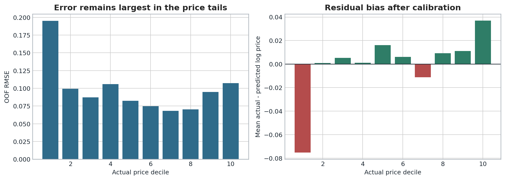

# Ames 房价预测项目复盘与实证分析

## 摘要

本项目使用 Ames Housing 数据预测住宅成交价格。最终方案由 Elastic Net、Gradient Boosting、XGBoost 和 RBF-SVR 四个模型组成，通过重复 OOF 预测、目标分层的元交叉验证和轻度线性校准生成提交结果。

截至 2026-08-24，V3 在 Kaggle 的 Public Score 为 **0.12163**，排名快照为 **430 / 3,454，Top 12.45%**。与 V2 的 `0.12205` 相比，V3 改善 `0.00042`，相对改善约 `0.34%`。提升真实存在，但幅度有限，说明新增模型和校准方向有效，尚不足以解决本地验证偏乐观的问题。

## 1. 问题与评价标准

训练集包含 1,460 套房屋、81 列；测试集包含 1,459 套房屋、80 列。除 `Id` 外共有 79 个预测变量，既有连续面积和年份，也有质量等级、社区和房屋类型等类别变量。

比赛使用对数价格上的均方根误差。为了让训练目标与评价方式一致，本项目直接预测 `log(SalePrice)`，提交前再使用指数函数还原价格。这样可以降低少数高价房对平方误差的支配，也更接近“百分比偏差”的业务直觉。

## 2. 数据处理判断

### 2.1 缺失值不能统一填充

`PoolQC`、`Alley`、`Fence`、`GarageType` 等字段的大量缺失并不等于采集失败，很多时候表示房屋没有对应设施。本项目把这类值编码为 `None`；只有在设施确实存在但质量字段仍为空时，才标记为 `Missing`。数值字段在模型管道内部按训练折中位数填充，并增加缺失指示变量。

`LotFrontage` 的缺失与社区布局有关，因此在 SVR 分支中按训练折的 `Neighborhood` 中位数填充，再退回全局中位数。这个处理放在交叉验证管道内部，验证折不会参与中位数计算。

### 2.2 异常值处理保持克制

散点检查发现 Id 524 和 1299 的居住面积均超过 4,000 平方英尺，但成交价明显偏低。二者符合比赛资料中常见的面积异常规则，仅在模型训练阶段移除。其余高价房和大面积房保留，以免把真正困难的样本误删成“异常”。

### 2.3 特征工程围绕可解释关系

构造特征包括总使用面积、总浴室数、总门廊面积、售出时房龄、翻新后年限、设施存在标记、质量与面积交互项、月份周期项和质量等级分数。每组特征都先经过 OOF 敏感性比较；没有因为“看起来合理”就全部塞进每个模型。

## 3. 模型筛选过程

初始候选覆盖线性正则、核方法、随机森林、极端随机树、Gradient Boosting、XGBoost、LightGBM 和 CatBoost。单次训练拟合误差没有用于选型，统一以五折 OOF RMSE 排序。

Lasso/Elastic Net 是最强单模，OOF 约为 `0.11000`；Gradient Boosting 和 XGBoost 的单模误差略高，但与线性模型存在互补残差。随机森林、Extra Trees 和早期 SVR 版本明显落后，因此没有为了“模型数量多”而进入最终融合。

V2 使用三模型重复交叉验证，稳健分数约 `0.10587`。提交后 Public Score 只有 `0.12205`，暴露出两个问题：三个模型的残差相关系数在 `0.868` 到 `0.923` 之间，树模型之间尤其相似；同时最低价组被高估、最高价组被低估，预测存在回归均值。

V3 因此没有继续堆更多树，而是加入经重新调参的 RBF-SVR。该模型的单模表现并非第一，但它和 XGBoost 的残差相关性下降到约 `0.853`，能提供不同的预测边界。最终稳健本地分数为 `0.10483`。

## 4. 最终融合与权重来源

最终权重为：Elastic Net `25.9%`、Gradient Boosting `23.4%`、XGBoost `24.3%`、RBF-SVR `26.5%`。

权重通过 OOF 预测求解：要求每个权重非负、总和为 1，以最小化对数价格均方误差；目标函数加入 `0.01` 的 L2 惩罚，防止小样本下权重过度集中。权重不是根据模型名气，也不是手工反复试 Kaggle 得到。8 组目标分层元交叉验证用于评估权重稳定性，最后采用各折权重均值。

在融合后，线性校准斜率为 `1.0157`。它把过度收缩的预测范围轻微拉开，但斜率限制在 `0.98` 至 `1.04`，避免根据同一批 OOF 残差做过度修正。

## 5. 实证结果

| 版本 | 稳健本地 RMSE | Kaggle Public Score | 排名快照 |
|---|---:|---:|---:|
| V2 三模型融合 | 0.10587 | 0.12205 | 493 / 3,454 |
| V3 四模型稳健融合 | 0.10483 | **0.12163** | **430 / 3,454** |

V3 的预测中位数约为 156,841 美元，最小值约为 46,061 美元，最大值约为 847,620 美元；全部为有限正数，行数、列名和 Id 顺序与官方样例一致。训练价格与测试预测的整体分布相近，没有出现明显的整体漂移或极端爆炸。

## 6. 误差诊断

### 6.1 价格两端仍然最难

最低价格十分位的 OOF RMSE 接近 `0.195`，明显高于中部价格段；最高价格十分位也重新上升。校准后，最低价组平均残差仍为负，表示预测偏高；最高价组平均残差为正，表示预测偏低。预测散点在中部贴近对角线，但两端向均值收缩。

### 6.2 本地验证仍然偏乐观

V3 的稳健本地 RMSE 为 `0.10483`，Public Score 为 `0.12163`，差距约 `0.01680`。对抗验证的平均 AUC 约为 `0.516`，接近随机判断，说明训练集和测试集不存在强烈的整体特征漂移。更可信的解释是：

1. 数据只有约 1,500 个训练样本，价格两端样本更少；
2. 多轮特征和参数实验重复使用同一训练集，存在模型选择偏差；
3. 最终成员虽增加到四个，但残差仍然高度相关；
4. OOF 权重和校准仍在同一训练样本上估计，不能完全替代未知测试集。

## 7. 为什么没有把 0.06 当作完成标准

隐藏测试标签使任何具体 Kaggle 分数都无法在提交前保证。公开榜单还混有外部标签、公开泄漏或直接重建测试答案的提交，它们不能代表正常机器学习泛化能力。为了让作品经得起复现和面试追问，本项目没有使用外部成交价，也没有根据公开榜单逐行修正测试答案。

`0.12163` 不是“接近完美”，但它是一条可以解释、可以复现、没有依赖测试标签的结果。对于个人作品，清楚说明失败原因和证据边界，比写一个无法说明来源的超低分更有价值。

## 8. 下一步改进

1. 保留一块从未参与特征和参数选择的最终验证集，或使用嵌套交叉验证评估选择偏差。
2. 针对低价房和高价房设计分层模型或分位数辅助特征，但必须在外层交叉验证中检验。
3. 用重复目标分层折重新训练全部基础模型，比较随机 KFold 与分层 KFold 对公共榜单稳定性的影响。
4. 研究社区与房龄、质量与面积之间的分层交互，同时控制高基数类别造成的方差。
5. 对融合权重做 bootstrap 稳定性区间，而不是只报告一个点估计。

## 9. 结论

项目完成了从数据理解、可复现预处理、模型筛选、融合、误差诊断到 Kaggle 提交的闭环。V3 比 V2 有小幅真实提升，排名快照进入前 `12.45%`；同时，公开分数与本地验证的差距提醒我：后续工作最需要加强的不是继续增加模型数量，而是建立更独立的验证层、降低选择偏差，并专门处理价格两端的系统性误差。
